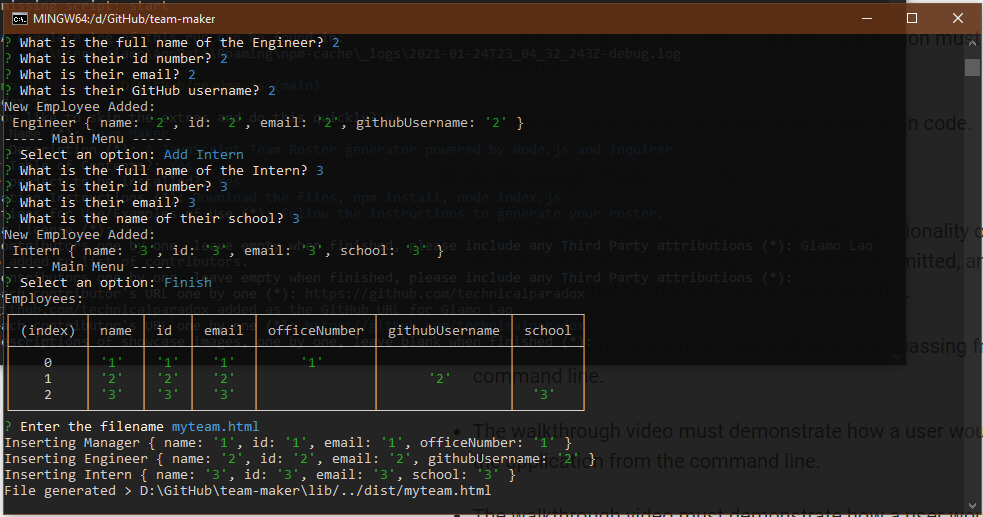

# Team-Maker
##### A JavaScript Team Roster generator powered by Node.js and Inquirer
### License
This project does not currently use a license.

---------------
## Table of Contents:
* [Installation](#installation)
* [Usage](#usage)
* [Credits](#credits)
* [Features](#features)
* [Contribution Guidelines](#contribution-guidelines)
* [Tests](#tests)
* [Questions](#questions)
---------------
## Installation:
Download the files, npm install, node index.js
## Usage
Follow the instructions to generate your roster.

[Video](https://youtu.be/ugbx4D0P9no)

## Credits
[Giamo Lao](https://github.com/technicalparadox)
## Features
* View your team easily
* Add multiple types of employees
* Easily link to your teams important info
## Contribution Guidelines
[The Contributor Covenant](https://www.contributor-covenant.org/)
## Tests
* You can find an example of an outputted file in ./dist/myteam.html
## Questions
Any questions should be directed to

[Giamo Lao](https://technicalparadox.github.io)

[giamolao98@gmail.com](mailto:https://technicalparadox.github.io)
